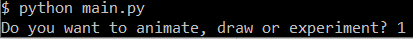
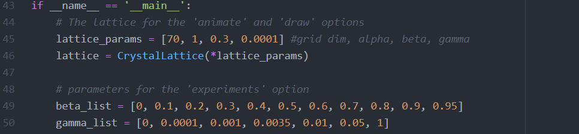
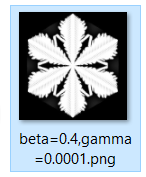
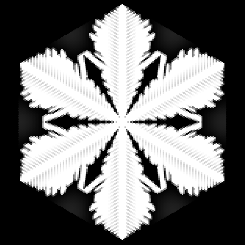

# Snowcrystal Formation with Hexagonal Cellular Automata

In this project we use a custom grid from hexagonal cellular automate to simulate the formation of snow crystals through diffusion limited aggregation. The goal is to research which underlying conditions the different archetypes of formations depend on.


## Getting Started

First make sure you have a version of Python 3 and all the prerequisite packages (see below) installed.

Our code offer 3 ways of viewing the formation of a snow crystal: A real time animation of the crystal lattice in the simulation over time, a final drawing at the end of the simulation and a series of experiments with optional drawing.

To choose which of the 3 ways you'd like to execute, run the **main.py** file in your terminal with:
```
python main.py
```
You will then be prompted to enter which way you'd like to execute. 
The options are:
- animate / 1
- draw / 2
- experiment / 3

The code will execute by entering one of these 3 strings/integers:



## Running Experiments
For all 3 options it is possible to change the parameters associated with the experiment. 'Draw' and 'animate' share the same parameters as they are essentially the same and 'experiment' works with 2 lists of beta and gamma values.

Adjustable parameters:
- window size
- crystal lattice size
- hexagon side lenghts
- alpha
- beta
- gamma

The parameters can be adjusted in the main part of the **main.py** file:



Window size determines the quadratic dimensions of the drawing window. Lattice size determines the dimensions of the hexagonal grid, since it is a skewed axial coordinate system and a symmetric grid, adding 1 to the lattice size will increase the lattice by 1 in all 4 directions, -q, q, -r, r, this also includes hexagon between these coordinates. Bare in mind that the consequence of this is an exponential amount of hexagons as a function of the lattice size.

In the example experiments (see the images and experiments folder) we use a lattice size of **100** and a window size of **700x700**. We recommend using the provided parameters of a lattice size of **70** and window size of **500x500** otherwise the computation time will be too great.

To reproduce the examples provided in the image folder you can look at the image name for the parameters and use either 'animate' or 'draw':





Should you choose to run the third option 'experiment' all combinations in the beta_list and gamma_list will be simulated and the crystal lattice will be saved as a .pickle in the experiments folder. To then visualize/draw the crystal lattices, we have provided another file **draw_pickles.py**. Simply execute this file and all the crystal lattices will be visualised and added to the images folder:

```
python draw_pickles.py
```
If you'd like the visualization of the experiments to be in a nice format, make sure that the window size and hexagonal side length parameters in **draw_pickles.py** are the same as in **main.py**

*If you wish to learn more about the diffusion parameters alpha, beta and gamma, please view our report or read the comments in the code.*

## Prerequisites

In this project we strictly use **Python 3**. All packages needed can be downloaded with pip or conda install.

```
pip install pyglet
pip install pillow
pip install numpy
pip install pandas
```

## Authors
- **Fenna Houtsma**
- **Christopher Buch Madsen**
- **Guido Vaessen** 

## Acknowledgments

This project was part of the Project Computational Science course in the Computational Science minor at the Universtiy of Amsterdam.

Our code were based on the following papers:
- Li,  J.   (2015).   On  the  modeling  of  snowflake  growth  usinghexagonal automata.
- Reiter, C. A.  (2005).  A local cellular model for snow crystalgrowth.Chaos, Solitons & Fractals,23(4), 1111–1119
- The **graphics.py** file by John Zelle
